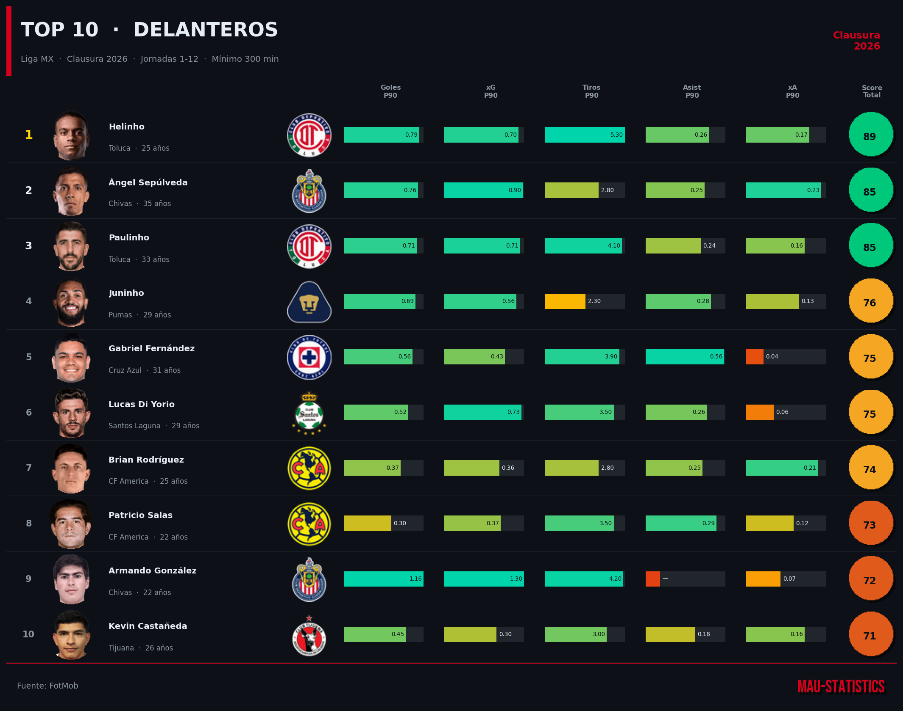
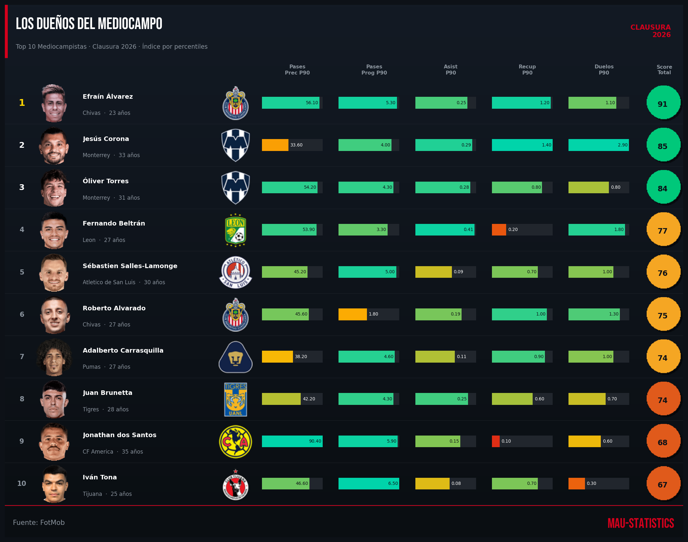
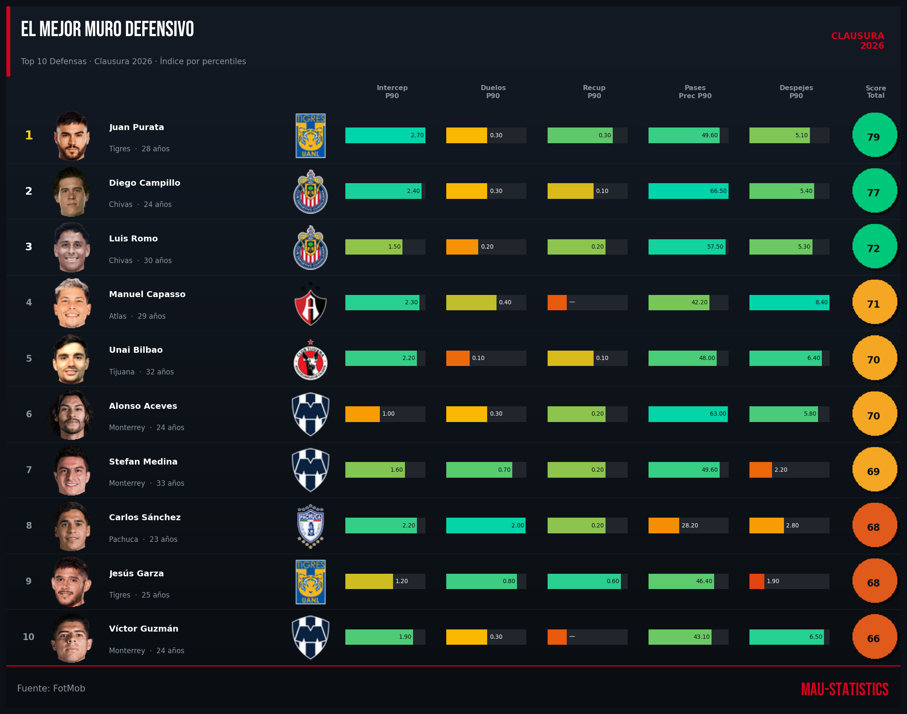
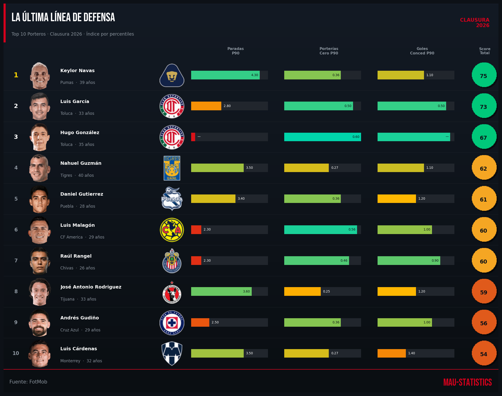
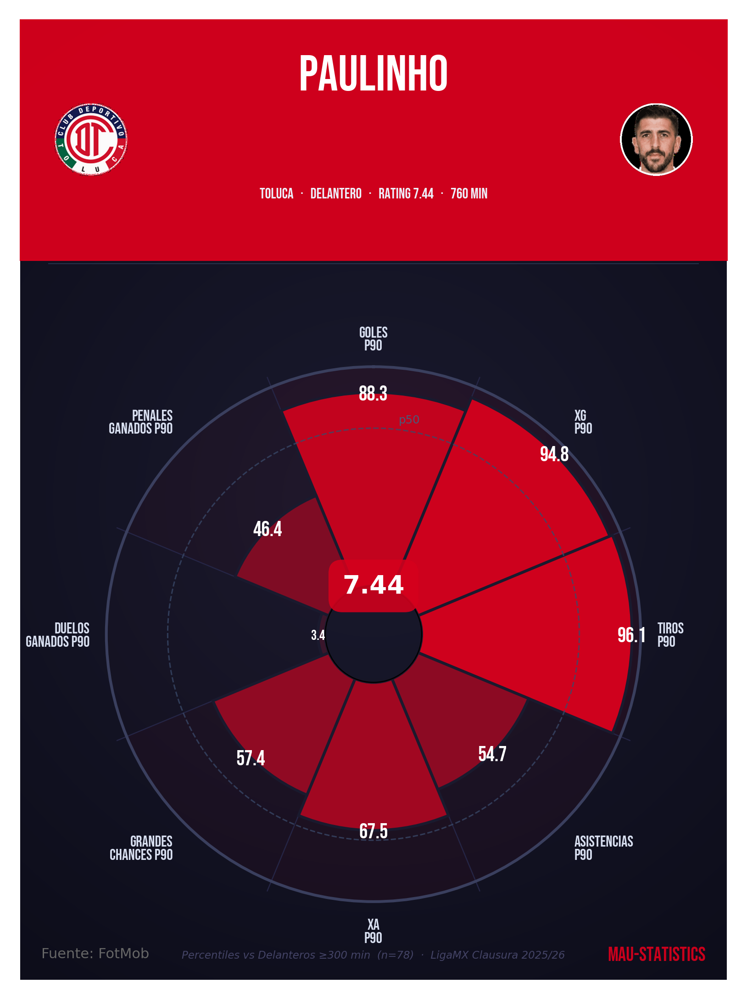
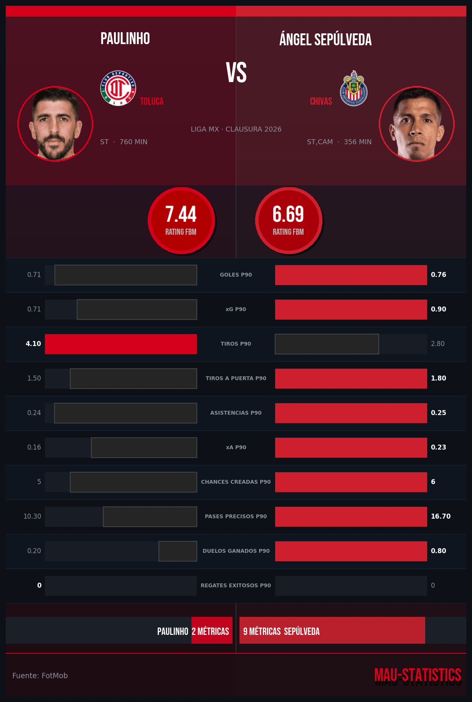
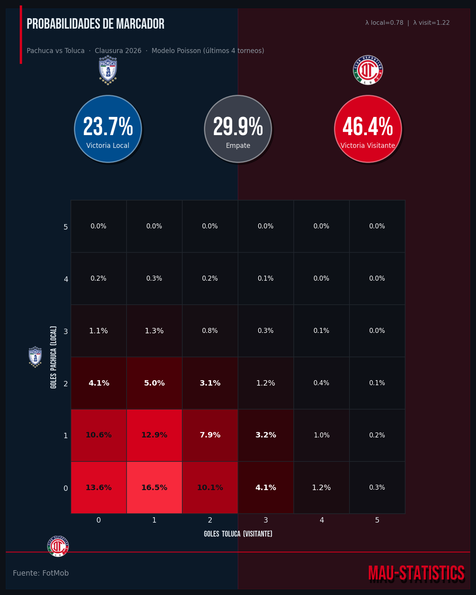
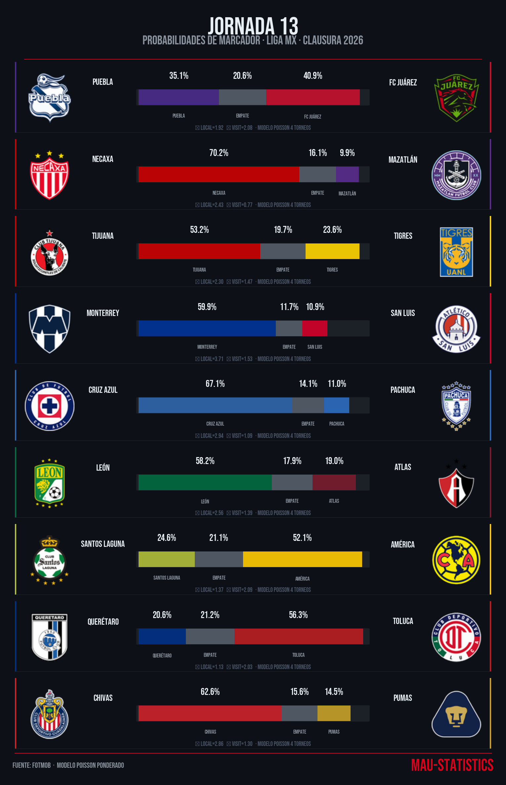
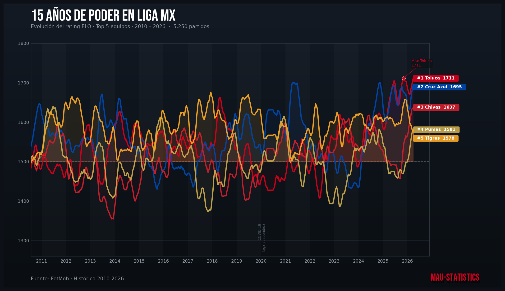
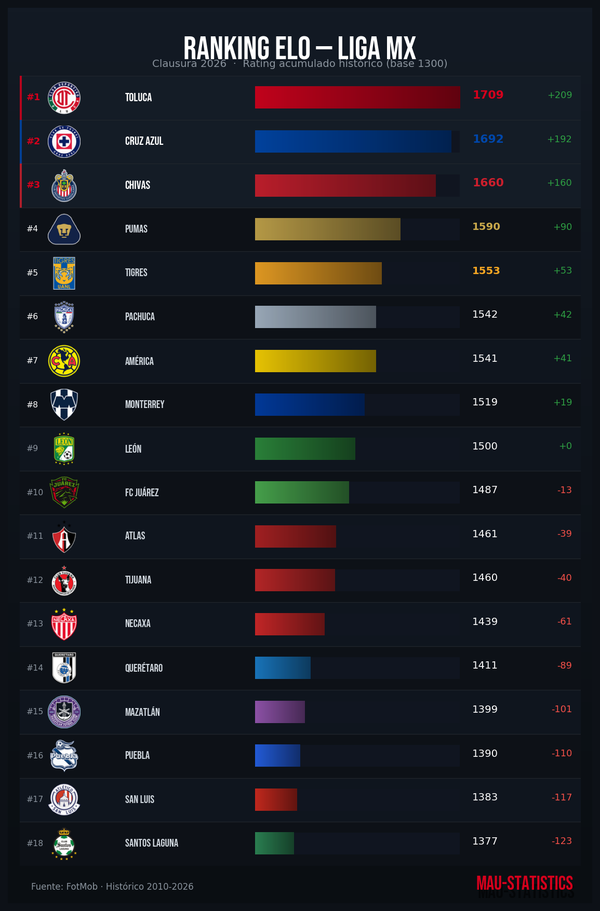

# ⚽ LigaMX Stats

> Motor de análisis estadístico de la **Liga MX** construido íntegramente sobre datos de [FotMob](https://www.fotmob.com).
> Scraping, limpieza, métricas per-90, visualizaciones de élite, modelo de Poisson para predicción de marcadores, simulación Monte Carlo, sistema de rating ELO histórico y **dashboard interactivo** con Plotly Dash — todo en Python puro.

---

## 🖥️ Dashboard Interactivo — MauStats MX

Dashboard oscuro profesional con sidebar fijo, tipografía Google Fonts (Bebas Neue + Roboto), Bootstrap Icons y tema DARKLY.

```bash
source .venv/bin/activate
python scripts/dashboard/app.py
# → http://localhost:8050
```

### Páginas del dashboard

| Página | Ruta | Contenido |
|---|---|---|
| **Home** | `/` | KPIs (líder, ELO #1, goleador, jornada) · tabla de posiciones · resultados J12 · próximos J13 |
| **Jornada 13** | `/jornada` | Dropdown de partidos · círculos de probabilidad (local/empate/visita) · heatmap Poisson 7×7 |
| **Ranking ELO** | `/elo` | Barras horizontales ranking actual · selector multi-equipo · línea temporal histórica |
| **Simulación** | `/sim` | Heatmap Monte Carlo 5 000 iteraciones · zonas liguilla / repechaje coloreadas |
| **Jugadores** | `/jugadores` | Pitch view con scatter de jugadores · radar de percentiles por posición · perfil + stats pills |
| **Comparativo** | `/comp` | Barras espejo 1v1 por percentil · selector equipo + jugador por lado |

### Stack del dashboard

| Librería | Versión | Uso |
|---|---|---|
| `dash` | ≥ 4.1.0 | Framework reactivo |
| `dash-bootstrap-components` | ≥ 2.0.4 | Tema DARKLY + Bootstrap Icons |
| `plotly` | ≥ 6.6.0 | Heatmaps, barras, scatter, radar polar |
| `pandas` | ≥ 2.3.0 | Datos en memoria |
| `scipy` | ≥ 1.15.0 | `poisson.pmf()` para el modelo |
| `numpy` | ≥ 2.2.0 | Matrices de probabilidad |

### Arquitectura del dashboard

```
scripts/dashboard/
├── app.py                  # App principal — datos, modelos, callbacks
├── pages/
│   ├── __init__.py
│   └── home.py             # Página HOME (layout independiente)
└── assets/
    ├── style.css           # Google Fonts @import · sidebar · cards · componentes
    └── teams/              # 18 escudos PNG servidos estáticamente por Dash
```

---

## 🎲 Simulación Monte Carlo — Clausura 2026

Corre **5 000 simulaciones** de los partidos restantes del torneo, usando las lambdas del modelo Poisson para cada duelo.

### Cómo funciona

Para cada simulación:
1. Se parte de la tabla real actual (puntos, GF, GC)
2. Para cada partido pendiente se sortean goles: `gl ~ Poisson(λ_local)`, `gv ~ Poisson(λ_visit)`
3. Se actualizan puntos y diferencia de goles
4. Se rankea la tabla final al ordenar por `(pts, DIF, GF)` desc
5. Se acumula la frecuencia de cada equipo en cada posición

El resultado es una **matriz 18×18** donde `P[equipo][posición]` = probabilidad de terminar en esa posición.

```python
# Llamada interna (app.py)
MC_T, MC_P = montecarlo(ATT, DEFE, MU, HA, n=5000)
```

### Visualización

- Heatmap verde-quetzal: oscuro (0%) → vibrante (70%+)
- Textos en blanco bold para celdas ≥ 20%
- Línea punteada dorada en posición 4 (Liguilla directa)
- Línea punteada verde en posición 8 (Repechaje)
- Equipos ordenados por posición esperada (menor `Σ pos × prob`)

### Bug histórico corregido ✅

El modelo de Poisson y el Monte Carlo estaban rotos porque los archivos históricos usan guión en el año (`historico_2025-2026_-_clausura.json`) pero el diccionario de pesos usaba slash (`'2025/2026 - Clausura'`). El `replace('_','/')` no convertía guiones → `mu = 0` → `λ = 0` → 100% empate y diagonal MC.

**Fix aplicado en `load_model()`:**
```python
# ANTES (roto)
tkey = f"{parts[0].replace('_','/')} - ..."
# DESPUÉS (correcto)
tkey = f"{parts[0].replace('-','/').replace('_','/')} - ..."
```
Con el fix: **608 partidos cargados**, `mu = 1.421` goles/partido promedio.

---

## 🖼️ Galería

### Rankings Top 10 por posición — Clausura 2026

| Delanteros | Mediocampistas |
|:---:|:---:|
|  |  |

| Defensas | Porteros |
|:---:|:---:|
|  |  |

---

### Pizza Chart P90 — Perfil individual

Métricas per-90 normalizadas por percentil contra todos los jugadores de la misma posición.
Fondo semitransparente con foto del jugador integrada.



---

### Comparativo 1 vs 1

Infografía cara a cara con barras espejo coloreadas por equipo, rating FotMob y conteo de victorias por métrica.



---

### Predicción de marcador — Modelo de Poisson

Heatmap de probabilidades de cada marcador posible (0-0 a 5-5), calculado con los últimos 4 torneos ponderados.



---

### Resumen de Jornada

Infografía de todos los partidos de una jornada: barras de probabilidad por equipo, marcador más probable y escudos.



---

### Sistema ELO — Evolución histórica

15 años de evolución del rating ELO de los 18 equipos actuales (Apertura 2010/11 → Clausura 2026). Suavizado con rolling window de 8 semanas.



---

### Sistema ELO — Ranking actual

Tabla de los 18 equipos ordenados por rating ELO al cierre del torneo más reciente, con barras de gradiente y delta respecto a la media (1500).



---

## 🗂️ Estructura del proyecto

```
LigaMX_Stats/
│
├── data/
│   ├── raw/
│   │   ├── equipos_clausura2026.json      # IDs y nombres de los 18 equipos
│   │   ├── historico/                     # 38 JSONs — torneos 2010/11 → 2025/26
│   │   │   ├── historico_YYYY-YYYY_-_apertura.json
│   │   │   ├── historico_YYYY-YYYY_-_clausura.json
│   │   │   └── historico_clausura_2026.json  # Torneo activo (tabla + partidos)
│   │   ├── jugadores/                     # Stats básicas por equipo (JSON x equipo)
│   │   ├── stats_detalladas/              # Stats granulares por jugador (JSON x jugador)
│   │   └── images/
│   │       ├── players/                   # Fotos de jugadores (caché local)
│   │       └── teams/                     # Escudos de equipos (caché local)
│   └── processed/
│       ├── jugadores_clausura2026.csv     # DataFrame maestro — stats limpias + P90
│       ├── jugadores_clausura2026.pkl     # Misma data en formato pickle
│       └── elo_historico.csv             # Historial completo de ratings ELO
│
├── scripts/
│   ├── config_visual.py                   # Paleta y utilidades visuales centralizadas
│   ├── 01_get_equipos.py                  # Paso 1 — Equipos del torneo activo
│   ├── 02_get_jugadores.py                # Paso 2 — Stats básicas de jugadores
│   ├── 02b_get_stats_jugadores.py         # Paso 2b — Stats detalladas por jugador
│   ├── 02c_get_stats_liga.py              # Paso 2c — Stats vía data.fotmob.com
│   ├── 03_radar_jugador.py                # Radar clásico con mplsoccer
│   ├── 04_consolidar_dataframe.py         # Consolida todos los JSONs en CSV/PKL
│   ├── 05_radar_p90.py                    # Pizza chart P90 estilo Statiskicks
│   ├── 07_ranking_posicion.py             # Top 10 por posición con foto y escudo
│   ├── 08_comparativo_1v1.py              # Infografía comparativa cara a cara
│   ├── 10_descargar_historico.py          # Histórico completo (38 torneos)
│   ├── 11_modelo_prediccion.py            # Modelo Poisson + heatmap de probabilidades
│   ├── 12_resumen_jornada.py              # Resumen visual de todos los partidos de jornada
│   ├── 12_modelo_elo.py                   # Sistema ELO histórico + evolución + ranking
│   └── dashboard/
│       ├── app.py                         # Dashboard Dash — servidor principal
│       ├── pages/
│       │   └── home.py                    # Página HOME (layout modular)
│       └── assets/
│           ├── style.css                  # Google Fonts + tema dark + componentes
│           └── teams/                     # Escudos servidos estáticamente
│
├── output/
│   └── charts/                            # PNGs generados (150 DPI)
│       ├── ranking_*.png
│       ├── pizza_*.png
│       ├── comparativo_*_vs_*.png
│       ├── prediccion_*_vs_*.png
│       ├── elo_evolucion.png
│       ├── elo_ranking.png
│       └── jornada13/
│
└── notebooks/                             # Exploración interactiva (Jupyter)
```

---

## 🛠️ Scripts — Guía de uso

### Pipeline de datos (ejecutar en orden la primera vez)

```bash
# 1. Obtener equipos del torneo activo
.venv/bin/python scripts/01_get_equipos.py
# → data/raw/equipos_clausura2026.json

# 2. Descargar stats básicas de jugadores por equipo
.venv/bin/python scripts/02_get_jugadores.py
# → data/raw/jugadores/{id}_{equipo}.json  (18 archivos)

# 3. Descargar stats detalladas por jugador individual
.venv/bin/python scripts/02b_get_stats_jugadores.py
# → data/raw/stats_detalladas/{id}.json

# 4. Consolidar todo en un DataFrame maestro
.venv/bin/python scripts/04_consolidar_dataframe.py
# → data/processed/jugadores_clausura2026.csv
```

---

### `scripts/dashboard/app.py` — Dashboard interactivo

Arranca el servidor Dash con el dashboard completo. Al iniciar carga:
- Modelo Poisson (608 partidos, 4 torneos ponderados)
- Simulación Monte Carlo (5 000 iteraciones)
- Serie histórica ELO
- DataFrame de jugadores (≥ 200 min)

```bash
source .venv/bin/activate
python scripts/dashboard/app.py
# Cargando modelo Poisson…  → 608 partidos, mu=1.421
# Monte Carlo (5 000 sim)…  → ~3s
# ELO + jugadores…
# Listo.
# → http://0.0.0.0:8050
```

---

### `05_radar_p90.py` — Pizza chart individual

Genera el perfil visual de un jugador con métricas per-90 normalizadas contra su posición. Fondo con foto semitransparente, escudo del equipo y Bebas Neue como tipografía.

```bash
# Por defecto genera el pizza chart de Paulinho (Toluca)
.venv/bin/python scripts/05_radar_p90.py

# Especificando jugador por nombre (parcial, case-insensitive)
.venv/bin/python scripts/05_radar_p90.py --nombre "Sepúlveda"
# → output/charts/pizza_angel_sepulveda_chivas.png

# Generar 3 ejemplos variados
.venv/bin/python scripts/05_radar_p90.py --todos
```

**Métricas por posición:**

| Posición | Métricas (8 radios) |
|---|---|
| **Delantero / CAM** | Goles P90, xG P90, Tiros P90, Asistencias P90, xA P90, Grandes Chances P90, Duelos Ganados P90, Penales Ganados P90 |
| **Mediocampista** | Pases Precisos P90, Pases Largos P90, Chances Creadas P90, Asistencias P90, xA P90, Recuperaciones Campo Rival P90, Intercepciones P90, Duelos Ganados P90 |
| **Defensa** | Intercepciones P90, Despejes P90, Recuperaciones Campo Rival P90, Entradas P90, Tiros Bloqueados P90, Pases Precisos P90, Pases Largos P90, Faltas Cometidas P90* |
| **Portero** | Paradas P90, % Paradas P90, Goles Evitados P90, Goles Recibidos P90*, Porterías en Cero P90, Pases Precisos P90, Pases Largos P90, Despejes P90 |

> `*` Métrica invertida: menor valor → mejor percentil.

**Metodología de normalización:**
Cada valor se transforma a percentil comparado únicamente contra jugadores de la misma posición con ≥ 300 minutos jugados. El percentil 100 es el mejor de su grupo posicional.

---

### `07_ranking_posicion.py` — Top 10 por posición

```bash
.venv/bin/python scripts/07_ranking_posicion.py
.venv/bin/python scripts/07_ranking_posicion.py --posicion Delantero
# Opciones: Delantero | Mediocampista | Defensa | Portero
```

---

### `08_comparativo_1v1.py` — Comparativo cara a cara

```bash
.venv/bin/python scripts/08_comparativo_1v1.py
.venv/bin/python scripts/08_comparativo_1v1.py 361377 215428
# → output/charts/comparativo_paulinho_vs_angel_sepulveda.png
```

---

### `10_descargar_historico.py` — Histórico completo Liga MX

Descarga **38 torneos** (Apertura/Clausura 2010/11 → 2025/26) con resultados partido a partido y tabla de posiciones.

```bash
.venv/bin/python scripts/10_descargar_historico.py
.venv/bin/python scripts/10_descargar_historico.py --force
# → data/raw/historico/historico_{año}_-_{torneo}.json
```

Estructura de cada JSON:
```json
{
  "torneo": "2025/2026 - Clausura",
  "season_id": 27048,
  "tabla": [...],
  "partidos": [
    {
      "id": 4712345,
      "fecha": "2026-01-18",
      "jornada": "1",
      "local": "Pachuca",
      "visitante": "Toluca",
      "goles_local": 2,
      "goles_visit": 1,
      "score": "2 - 1",
      "terminado": true
    }
  ]
}
```

---

### `11_modelo_prediccion.py` — Modelo de Poisson

Predice la distribución de probabilidad de marcadores para cualquier partido de Liga MX.

```bash
.venv/bin/python scripts/11_modelo_prediccion.py "Pachuca" "Toluca"
# → output/charts/prediccion_pachuca_vs_toluca.png
```

**Salida de ejemplo:**
```
P(Victoria Pachuca) = 23.7%
P(Empate)           = 29.9%
P(Victoria Toluca)  = 46.4%
Score más probable:  0-1  (16.5%)
```

**Metodología — cómo funciona:**

```
λ_local     = att[local]  × defe[visita] × μ × home_advantage(1.15)
λ_visitante = att[visita] × defe[local]  × μ
```

Los factores se calculan con los **últimos 4 torneos ponderados**:

| Torneo | Peso |
|---|---|
| Clausura 2026 | **4** |
| Apertura 2025 | **3** |
| Clausura 2025 | **2** |
| Apertura 2024 | **1** |

`μ` = promedio ponderado de goles por partido en la liga (actualmente **1.421**).

La **matriz de probabilidades 7×7** (marcadores 0-0 a 6-6) se calcula como:
```
P(local=i, visita=j) = Poisson(i; λ_local) × Poisson(j; λ_visita)
```

---

### `12_resumen_jornada.py` — Resumen visual de jornada

```bash
.venv/bin/python scripts/12_resumen_jornada.py
# → output/charts/jornada13/resumen_jornada13.png
```

---

### `12_modelo_elo.py` — Sistema de rating ELO histórico

Procesa los **38 torneos históricos** y genera la evolución temporal y el ranking actual.

```bash
.venv/bin/python scripts/12_modelo_elo.py
# → data/processed/elo_historico.csv
# → output/charts/elo_evolucion.png
# → output/charts/elo_ranking.png
```

**Metodología ELO:**

| Parámetro | Valor | Descripción |
|---|---|---|
| `ELO_BASE` | 1500 | Rating inicial de todo equipo |
| `K` | 32 | Factor de actualización máximo por partido |
| `HOME_ADV` | 100 | Puntos extra para el local al calcular probabilidad esperada |
| `SCALE` | 400 | Escala logística estándar |
| `REGRESSION` | 30% | Regresión a la media al inicio de cada torneo |

**Fórmula:**
```
E_local = 1 / (1 + 10^((ELO_visita - ELO_local - HOME_ADV) / 400))
ΔElo    = K × GoalMarginMultiplier × (resultado_real - E_local)

GoalMarginMultiplier = 1.0 + ln(|GL - GV| + 1) × 0.5
```

**Regresión entre torneos:**
```
ELO_nuevo = ELO_actual + 0.30 × (1500 - ELO_actual)
```

---

## 📐 `config_visual.py` — Paleta de identidad MAU-STATISTICS

```python
from config_visual import PALETTE, bebas, hex_rgba, hex_rgb
```

| Token | Hex | Uso |
|---|---|---|
| `bg_main` | `#0d1117` | Fondo principal |
| `bg_secondary` | `#161b22` | Filas alternas / header |
| `accent` | `#D5001C` | Rojo MAU-STATISTICS |
| `positive` | `#2ea043` | Delta positivo |
| `negative` | `#f85149` | Delta negativo |
| `border` | `#30363d` | Bordes |

```python
bebas(size)              # kwargs Bebas Neue para matplotlib
hex_rgb(hex)             # '#RRGGBB' → (R, G, B)
hex_rgba(hex, a=1.0)     # '#RRGGBB' → (r, g, b, a)
darken(hex, factor=0.55) # Oscurece un color
make_h_gradient(hex)     # Array RGBA (1, w, 4) gradiente horizontal
```

---

## 📊 Métricas P90 disponibles

El archivo `data/processed/jugadores_clausura2026.csv` contiene **41 columnas** incluyendo:

**Tiro / Gol:** `goles_p90`, `xG_p90`, `tiros_p90`, `tiros_a_puerta_p90`, `grandes_chances_p90`

**Pase / Creación:** `asistencias_p90`, `xA_p90`, `chances_creadas_p90`, `pases_precisos_p90`, `pases_largos_p90`

**Posesión / Duelos:** `duelos_tierra_ganados_p90`, `recuperaciones_campo_rival_p90`

**Defensa:** `intercepciones_p90`, `entradas_p90`, `despejes_p90`, `tiros_bloqueados_p90`, `faltas_cometidas_p90`

**Portería:** `paradas_p90`, `porcentaje_paradas_p90`, `goles_recibidos_p90`, `goles_evitados_p90`, `porterias_cero_p90`

**Disciplina:** `tarjetas_amarillas_p90`, `tarjetas_rojas_p90`, `penales_ganados_p90`

---

## 🚀 Setup

```bash
# 1. Clonar repositorio
git clone git@github.com:MauCarVaz1995/LigaMX.git
cd LigaMX

# 2. Crear entorno virtual e instalar dependencias
python3 -m venv .venv
source .venv/bin/activate
pip install -r requirements.txt

# 3. (Recomendado) Instalar fuente Bebas Neue localmente
mkdir -p ~/.fonts
curl -sL "https://github.com/dharmatype/Bebas-Neue/raw/master/fonts/ttf/BebasNeue-Regular.ttf" \
     -o ~/.fonts/BebasNeue.ttf
fc-cache -fv

# 4. Arrancar el dashboard
python scripts/dashboard/app.py
# → http://localhost:8050
```

**`requirements.txt`:**
```
dash>=4.1.0
dash-bootstrap-components>=2.0.4
plotly>=6.6.0
pandas>=2.3.0
numpy>=2.2.0
scipy>=1.15.0
matplotlib>=3.10.0
Pillow>=12.1.0
```

---

## 📡 Fuentes de datos

Todos los datos provienen de **FotMob** mediante scraping del JSON embebido `__NEXT_DATA__` o de la API no oficial `data.fotmob.com`.

| Endpoint | Contenido |
|---|---|
| `fotmob.com/leagues/230/...` | Página del torneo Clausura 2026 |
| `fotmob.com/leagues/230/matches?season=...` | Resultados por torneo (histórico) |
| `data.fotmob.com/leagues?id=230&...` | Stats de jugadores del torneo activo |
| `fotmob.com/players/{id}/...` | Stats detalladas por jugador |
| `images.fotmob.com/image_resources/playerimages/{id}.png` | Fotos de jugadores |
| `images.fotmob.com/image_resources/logo/teamlogo/{id}.png` | Escudos de equipos |

> Liga MX = `league_id: 230` en FotMob.

---

## 🧱 Stack completo

| Librería | Uso |
|---|---|
| `pandas` | Manipulación, limpieza y feature engineering |
| `matplotlib` | Visualizaciones estáticas (pizza, ranking, comparativo, ELO) |
| `Pillow` (PIL) | Imágenes circulares, escudos, composición RGBA |
| `requests` | Scraping HTTP |
| `scipy` | `poisson.pmf()` para modelo de predicción |
| `numpy` | Matrices de probabilidad, Monte Carlo, gradientes |
| `dash` | Dashboard interactivo reactivo |
| `dash-bootstrap-components` | Tema DARKLY, Bootstrap Icons, layout grid |
| `plotly` | Heatmaps, barras, scatter, radar polar (dashboard) |
| `mplsoccer` | Radar chart base (script 03) |

---

## 🗺️ Roadmap

- [x] Scraping de equipos y jugadores (Clausura 2026)
- [x] DataFrame maestro con stats P90 por posición (41 columnas)
- [x] Pizza chart P90 individual (Statiskicks style)
- [x] Ranking visual Top 10 por posición
- [x] Comparativo 1v1 con barras espejo
- [x] Histórico completo 15 años (38 torneos, ~5 800 partidos)
- [x] Modelo de Poisson ponderado por torneo (mu=1.421, 608 partidos)
- [x] Resumen visual de jornada completa
- [x] Sistema de rating ELO histórico (evolución + ranking)
- [x] Paleta centralizada MAU-STATISTICS (`config_visual.py`)
- [x] **Dashboard interactivo Dash** — 6 páginas, sidebar, dark theme
- [x] **Simulación Monte Carlo** — 5 000 iteraciones, heatmap de posiciones finales
- [x] **Pitch view** — scatter de jugadores sobre cancha real con colores por rating
- [x] **Radar de percentiles** — por posición, coloreado por equipo
- [x] **Comparativo 1v1 interactivo** — barras espejo en el dashboard
- [ ] Predicciones automáticas actualizadas en cada jornada
- [ ] Análisis de rachas y forma reciente (últimos 5 partidos)
- [ ] Comparativo de temporadas por equipo
- [ ] Integración ELO como feature en el modelo de Poisson
- [ ] Exportar PDF de resumen de jornada desde el dashboard

---

<p align="center">
  <strong>MAU-STATISTICS</strong> · Datos: FotMob · Liga MX 2010 – 2026
</p>
