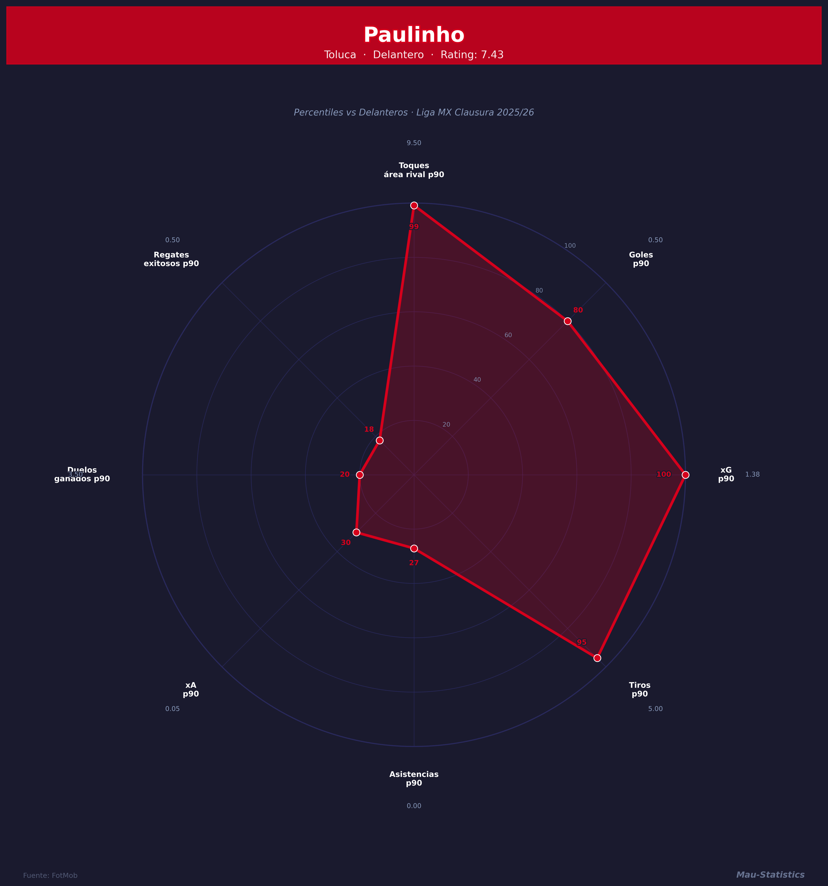

# ⚽ LigaMX Stats

> Motor de análisis estadístico de la **Liga MX** construido sobre datos de [FotMob](https://www.fotmob.com).
> Scraping, limpieza, visualizaciones de élite y un **modelo de Poisson** para predicción de marcadores — todo en Python.

---

## 🖼️ Galería rápida

### Rankings Top 10 por posición — Clausura 2026

| Delanteros | Mediocampistas |
|:---:|:---:|
|  |  |

| Defensas | Porteros |
|:---:|:---:|
|  |  |

---

### Radar individual (p90)

Perfil de rendimiento normalizado por 90 minutos frente a todos los jugadores de la misma posición en el torneo.



---

### Comparativo 1 vs 1

Infografía cara a cara con barras espejo, colores de equipo y conteo de victorias por métrica.


---

### Predicción de marcador — Modelo de Poisson

Probabilidad de cada resultado posible en un partido, calculada a partir de los últimos **4 torneos** ponderados.


---

## 🗂️ Estructura del proyecto

```
LigaMX_Stats/
│
├── data/
│   ├── raw/
│   │   ├── historico/          # 32 JSONs – todos los torneos 2010/11 → 2025/26
│   │   └── images/             # Fotos de jugadores y escudos (cache local)
│   └── processed/
│       └── jugadores_clausura2026.csv   # Stats limpias Clausura 2026
│
├── scripts/
│   ├── 01_scraper_jugadores.py          # Descarga stats de jugadores (FotMob)
│   ├── 02_limpiar_datos.py              # Normalización y feature engineering
│   ├── 05_radar_jugador.py              # Radar p90 individual
│   ├── 06_pizza_chart.py                # Pizza chart (versión alternativa)
│   ├── 07_ranking_posicion.py           # Top 10 por posición con imagen
│   ├── 08_comparativo_1v1.py            # Infografía 1 vs 1 lado a lado
│   ├── 10_descargar_historico.py        # Descarga histórico completo (32 torneos)
│   └── 11_modelo_prediccion.py          # Modelo Poisson + heatmap de probabilidades
│
├── output/
│   └── charts/                          # PNGs generados (rankings, radares, predicciones)
│
└── notebooks/                           # Exploración interactiva (Jupyter)
```

---

## 🚀 Setup

```bash
# 1. Clonar repositorio
git clone git@github.com:MauCarVaz1995/LigaMX.git
cd LigaMX

# 2. Crear entorno virtual e instalar dependencias
python3 -m venv .venv
source .venv/bin/activate
pip install pandas matplotlib Pillow requests scipy

# 3. (Opcional) Fuente Bebas Neue para las visualizaciones
mkdir -p ~/.fonts
curl -sL "https://github.com/dharmatype/Bebas-Neue/raw/master/fonts/ttf/BebasNeue-Regular.ttf" \
     -o ~/.fonts/BebasNeue.ttf
fc-cache -fv
```

---

## 🛠️ Scripts — Guía de uso

### `01_scraper_jugadores.py` — Descarga de estadísticas

Extrae las stats de todos los jugadores del torneo activo desde FotMob vía scraping del `__NEXT_DATA__` embebido en el HTML.

```bash
.venv/bin/python scripts/01_scraper_jugadores.py
# → data/processed/jugadores_clausura2026.csv
```

---

### `07_ranking_posicion.py` — Top 10 por posición

Genera un **ranking visual** para cada posición (Delantero, Mediocampista, Defensa, Portero).

- Filtra jugadores con ≥ 300 minutos jugados.
- Calcula un **Índice Compuesto** = promedio de percentiles por métrica dentro de la misma posición.
- Descarga fotos circulares de jugadores y escudos desde FotMob.
- Barras horizontales con gradiente rojo→verde.
- Score Total como círculo de color (🟢 top 3 / 🟡 top 7 / 🟠 resto).

```bash
# Todas las posiciones
.venv/bin/python scripts/07_ranking_posicion.py

# Una posición específica
.venv/bin/python scripts/07_ranking_posicion.py --posicion Delantero
# → output/charts/ranking_delantero.png
```

---

### `08_comparativo_1v1.py` — Comparativo cara a cara

Infografía de dos jugadores con **barras espejo**, color de equipo, rating y conteo de victorias por métrica.

```bash
# Por defecto: Paulinho vs Ángel Sepúlveda
.venv/bin/python scripts/08_comparativo_1v1.py

# Con IDs de FotMob específicos
.venv/bin/python scripts/08_comparativo_1v1.py 361377 215428
# → output/charts/comparativo_<jugador1>_vs_<jugador2>.png
```

> Los IDs de jugador se encuentran en la URL de FotMob: `fotmob.com/players/361377/paulinho`

---

### `10_descargar_historico.py` — Histórico completo Liga MX

Descarga **32 torneos** (Apertura/Clausura desde 2010/2011 hasta 2025/2026) con resultados y tabla de posiciones.

```bash
# Descarga todos los torneos (salta los ya existentes)
.venv/bin/python scripts/10_descargar_historico.py

# Forzar re-descarga aunque ya existan
.venv/bin/python scripts/10_descargar_historico.py --force
# → data/raw/historico/historico_<año>_-_<torneo>.json  (32 archivos)
```

Cada JSON tiene la forma:
```json
{
  "torneo": "2025/2026 - Clausura",
  "season_id": 27048,
  "tabla": [...],
  "partidos": [
    {
      "id": 4712345,
      "fecha": "2026-01-18",
      "jornada": 1,
      "local": "Pachuca",
      "visitante": "Toluca",
      "goles_local": 2,
      "goles_visit": 1,
      "score": "2 - 1",
      "terminado": true
    }
  ]
}
```

---

### `11_modelo_prediccion.py` — Modelo de Poisson

Predice la distribución de probabilidad de marcadores para cualquier partido de Liga MX.

#### ¿Cómo funciona?

El modelo usa la distribución de **Poisson** para estimar los goles esperados de cada equipo:

```
λ_local    = ataque_local(A) × defensa_visitante(B) × μ_home
λ_visitante = ataque_visitante(B) × defensa_local(A)    × μ_away
```

Donde:
- **μ_home / μ_away** = promedio global de goles en casa / fuera (línea base).
- **ataque[equipo][home|away]** = factor ofensivo del equipo relativo a la media.
- **defensa[equipo][home|away]** = factor defensivo del rival relativo a la media.

Los factores se calculan sobre los últimos **4 torneos ponderados**:

| Torneo | Peso |
|--------|------|
| Clausura 2026 | **4** |
| Apertura 2025 | **3** |
| Clausura 2025 | **2** |
| Apertura 2024 | **1** |

Con los λ estimados se computa la **matriz de probabilidades 6×6** de marcadores (0-0 a 5-5):

```
P(local=i, visitante=j) = Poisson(i; λ_local) × Poisson(j; λ_visitante)
```

Las probabilidades de resultado se obtienen sumando las celdas correspondientes.

```bash
.venv/bin/python scripts/11_modelo_prediccion.py "Pachuca" "Toluca"
# → output/charts/prediccion_pachuca_vs_toluca.png
```

**Salida de ejemplo (Clausura 2026, Jornada 12):**

```
λ local     = 0.78  (Pachuca en casa)
λ visitante = 1.22  (Toluca de visita)

P(Victoria Pachuca) = 23.7%
P(Empate)           = 29.9%
P(Victoria Toluca)  = 46.4%

Score más probable:  0-1  (16.5%)
```

---

## 📊 Datos — Fuente

Todos los datos provienen de **FotMob** mediante scraping del JSON embebido `__NEXT_DATA__` en cada página.
No se usa ninguna API oficial ni de terceros — solo `requests` + parsing manual.

| Endpoint | Contenido |
|----------|-----------|
| `fotmob.com/leagues/230/...` | Stats de jugadores Clausura 2026 |
| `fotmob.com/leagues/230/matches?season=...` | Resultados por torneo |
| `images.fotmob.com/image_resources/playerimages/{id}.png` | Fotos de jugadores |
| `images.fotmob.com/image_resources/logo/teamlogo/{id}.png` | Escudos de equipos |

> Liga MX = `league_id: 230` en FotMob.

---

## 🗺️ Roadmap

- [x] Scraping de stats de jugadores (Clausura 2026)
- [x] Radar p90 individual
- [x] Rankings Top 10 por posición con visualización
- [x] Comparativo 1v1
- [x] Descarga histórico completo (32 torneos)
- [x] Modelo de Poisson para predicción de marcadores
- [ ] Dashboard interactivo (Streamlit / Dash)
- [ ] Predicciones automatizadas para la jornada vigente
- [ ] Análisis de rachas y forma reciente
- [ ] Modelo ELO por equipo

---

## 🧰 Stack

| Librería | Uso |
|----------|-----|
| `pandas` | Manipulación y análisis de datos |
| `matplotlib` | Todas las visualizaciones |
| `Pillow` | Edición de imágenes (círculos, máscaras) |
| `requests` | Scraping HTTP |
| `scipy` | Distribución de Poisson |
| `numpy` | Álgebra lineal y matrices |

---

<p align="center">
  <strong>MAU-STATISTICS</strong> · Datos: FotMob · Liga MX 2025/2026
</p>
